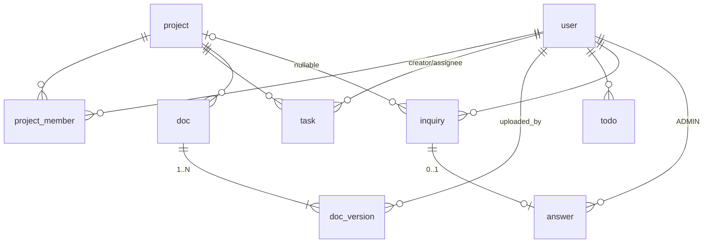

# 오합지졸.io 요구사항 명세 및 개발 명세 v1.1

| 항목 | 내용 |
| --- | --- |
| 문서 버전 | v1.1 (ERD v1.1 / API v1.2 기준) |
| 작성일 | 2026-07-13 |
| 상태 | 요구사항 확정 · 구현 착수 전 |
| 관련 문서 | ERD 노션용 v1.1, schema.sql v1.1, API 명세 v1.2 |

---

# 0. 검토 역할과 규칙

본 문서는 아래 역할과 규칙에 따라 작성·검토되었다.

**역할:** 10년 이상 Python3와 FastAPI를 사용하는 백엔드 아키텍트

**규칙**

1. 절대 추측하지 않는다.
2. 모호한 내용은 질문 목록으로 정리한다.
3. 기능을 임의로 추가하지 않는다.
4. 실무에서 일반적으로 사용하는 구조를 기준으로 검토한다.
5. 구현 코드는 작성하지 않는다. (본 문서는 명세까지만 다룬다)
6. 확정되지 않은 사항은 "기준안"으로 표기하고 팀 승인 대상으로 남긴다.

---

# 1. 프로젝트 개요

| 항목 | 내용 |
| --- | --- |
| 프로젝트명 | 오합지졸.io |
| 목적 | 팀 프로젝트 협업 서비스 |
| 대상 사용자 | 부트캠프 프로젝트 팀, 팀당 2~20명 |
| MVP 도메인 | 회원(요금제 포함), 프로젝트, 업무(Task), 간트차트, 개인 Todo, 자료실(버전관리), 1:1 문의, 관리자 |

## MVP 제외 (확정)

비밀번호 재설정(추후 이메일 인증 방식) · 회원 정지 · 팀원 초대 API(코드 공유로 갈음) · 결제 연동(요금제는 모의 전환만) · Task 진척률(%) · 선행 작업(Dependency) · 작업 연결선 · 마일스톤 · 자동 일정 계산 · 일정 드래그 수정 · 실시간 동기화 · 알림 · 데이터 복구 기능

---

# 2. 요구사항 명세

## 2-1. 회원 (User)

### 기능
회원가입 / 로그인 / 로그아웃 / 토큰 재발급 / 아이디·이메일·닉네임 중복 확인 / 내 정보 조회·수정 / 회원 탈퇴 / 요금제 전환

### 정책
- 로그인: `login_id + password`. 로그인 실패 시 계정 존재 여부를 노출하지 않는다(401 통일).
- 중복 불가(UNIQUE): **login_id, email, nickname**. 이름은 중복 허용.
- 비밀번호: bcrypt 등 단방향 해시만 저장. 정책(기준안): 8~64자, 영문+숫자 포함.
- 정보 수정 범위(기준안): 닉네임·이메일·비밀번호. 이름·login_id는 변경 불가.
- 탈퇴: Soft Delete. 탈퇴 시 **login_id/email/nickname 3종을 변형 저장**(예: `del_{탈퇴시각}_{원본}`)하여 동일 값으로 재가입 가능.
- 탈퇴 조건: LEADER인 프로젝트가 하나라도 있으면 거부(409) — 전부 위임 또는 삭제 후 가능.

### 요금제 (v1.1)
- 값: `FREE`(가입 시 기본) | `PRO`. **요금제에 따른 기능 제한 없음(표시용)** — 결제 연동 전 단계.
- 전환: 본인이 모의 결제 버튼으로 즉시 전환. `PUT /api/users/me/plan`.
- PRO 전환 시 `plan_expires_at = 전환 시점 + 30일`. PRO 재호출 = 재구독(만료일 갱신). FREE 전환 = 즉시 해지(만료일 NULL).
- 만료 처리(기준안): 배치 없이 로그인·내 정보 조회 시점에 만료 확인 후 FREE로 lazy 전환.
- 결제 연동 시 전환 API는 결제 완료 흐름으로 대체 예정.

## 2-2. 프로젝트 (Project / ProjectMember)

### 기능
생성 / 수정 / 삭제 / 내 목록 조회 / 상세 조회 / 코드 참여 / 코드 재발급 / 멤버 목록 / 탈퇴 / 강퇴 / 팀장 위임

### 정책
- 생성: 로그인 사용자 누구나. 생성 시 참여 코드 자동 발급 + 생성자가 `LEADER`로 등록(단일 트랜잭션).
- 참여: 코드 입력. 코드는 UNIQUE, 만료 없음, LEADER가 재발급 가능(기존 코드 즉시 무효).
- 조회: **멤버만** 상세·하위 리소스 접근 가능. 비멤버는 403.
- 팀장: 프로젝트당 정확히 1명. `project_member.role=LEADER`로 관리 (project 테이블에 팀장 컬럼 없음).
- 위임: LEADER → 같은 프로젝트의 MEMBER. 위임 후 기존 팀장은 MEMBER (단일 트랜잭션, 멱등 교체 → PUT).
- 탈퇴: MEMBER는 언제든 가능. LEADER는 위임 후에만 가능(409). project_member는 **Hard Delete**, 재참여 시 신규 행.
- 삭제: LEADER만. 프로젝트 + 하위 Task·자료실(게시글+전체 버전) 동기 Soft Delete (Todo 제외, 단일 트랜잭션).

## 2-3. 업무 (Task) / 간트차트

### 기능
생성 / 목록(필터) / 상세 / 수정 / 상태 변경 / 삭제 / 프로젝트별 간트차트 조회

### 정책
- 생성: 프로젝트 멤버. 담당자 1명, 미지정 시 생성자 자동 할당.
- 상태: DB 코드값 `TODO | IN_PROGRESS | DONE` (화면 표시명 대기중/진행중/완료는 프론트 매핑).
- 일정: `start_date`, `end_date` **필수(NOT NULL)**, start ≤ end.
- 수정·삭제: 작성자 또는 LEADER.
- 상태 변경: **담당자 또는 LEADER** (수정과 권한 주체가 달라 전용 엔드포인트 분리).
- 간트차트: 멤버 누구나 조회. Task 이름·담당자·시작일·종료일·상태 표시, 색상은 프론트 결정.
- 프로젝트 진행률 = 완료 Task / 전체 Task × 100 (Soft Delete 제외, 프로젝트 단위).

## 2-4. 개인 Todo

- 프로젝트와 무관한 개인 전용. 본인만 CRUD (타인 것 접근 시 404).
- 상태: `DONE | NOT_DONE`. 프로젝트 삭제 cascade 대상 아님.

## 2-5. 자료실 (Doc / DocVersion) — v1.1 버전관리

### 기능
자료(게시글) 등록 / 목록 / 상세 / 게시글 수정 / 삭제 / 최신 버전 다운로드 / **새 버전 업로드 / 버전 목록 / 특정 버전 다운로드 / 개별 버전 삭제**

### 정책
- 형태: 게시글(title, content) + 파일 버전 이력. 등록 시 파일 필수 → **version 1 자동 생성**. 게시글은 항상 유효 버전 ≥ 1.
- 파일: 최대 **20MB**, 허용 확장자 `pdf docx xlsx pptx zip png jpg jpeg`. 저장은 로컬 디스크(UUID 난수명) + DB 메타데이터.
- 새 버전 업로드: **프로젝트 멤버 누구나** (version_no = 현재 MAX + 1). 버전 수 무제한.
- 최신 버전 = 삭제되지 않은 버전 중 최대 version_no.
- 게시글 수정: title/content만(JSON). 파일 변경은 항상 새 버전 업로드로. 권한: 작성자 또는 LEADER.
- 개별 버전 삭제: Soft Delete. 권한(기준안): 업로더 본인 또는 LEADER. **마지막 남은 버전은 삭제 불가(409)**.
- 게시글 삭제: 작성자 또는 LEADER. 하위 버전 전체 Soft Delete.

## 2-6. 1:1 문의 (Inquiry / Answer)

- 등록: 로그인 사용자, 마이페이지 > 1:1 문의. 첨부 선택 1개(자료실과 동일 제한). `project_id` 선택 입력(일반 문의는 NULL).
- 조회: 본인 것만. SYSTEM_ADMIN은 전체 조회 가능.
- 상태: 등록 시 `WAITING` → 답변 등록 시 `ANSWERED`.
- 수정·삭제: 작성자 본인, **WAITING 상태에서만** (답변완료 후 409).
- 답변: SYSTEM_ADMIN만, 문의당 1개(DB UNIQUE 보장), 답변 생성 + 상태 전환은 단일 트랜잭션.

## 2-7. 관리자 (SYSTEM_ADMIN)

- 계정: 별도 테이블 없이 `user.role = SYSTEM_ADMIN`. 가입 API로 생성 불가 → 시드 스크립트로 초기 생성.
- 기능: 회원 조회·삭제, 프로젝트 조회·삭제, 문의 전체 조회·답변. 회원 정지는 MVP 제외.
- 회원 삭제(기준안): 본인 탈퇴와 동일 로직 — 대상이 LEADER인 프로젝트가 있으면 409 거부.
- 프로젝트 삭제(기준안): LEADER의 삭제와 동일한 cascade Soft Delete.

## 2-8. 권한 매트릭스

| 기능 | SYSTEM_ADMIN | PROJECT_LEADER | PROJECT_MEMBER | 로그인 유저 |
| --- | :---: | :---: | :---: | :---: |
| 프로젝트 생성 | ✓ | — | — | ✓ (생성자=LEADER) |
| 프로젝트 수정/삭제/코드 재발급/강퇴/위임 | ✓(관리) | ✓ | ✗ | ✗ |
| 프로젝트 상세/멤버/간트 조회 | ✓ | ✓ | ✓ | ✗ |
| 프로젝트 탈퇴 | — | ✗(위임 후) | ✓ | — |
| Task 생성 | — | ✓ | ✓ | ✗ |
| Task 수정/삭제 | — | ✓(전체) | 본인 작성분만 | ✗ |
| Task 상태 변경 | — | ✓(전체) | **담당 Task만** | ✗ |
| 자료 등록/조회/다운로드/**새 버전 업로드** | — | ✓ | ✓ | ✗ |
| 게시글 수정/삭제 | — | ✓(전체) | 본인 작성분만 | ✗ |
| **개별 버전 삭제** | — | ✓(전체) | **본인 업로드분만** | ✗ |
| Todo CRUD | 본인 것만 | 본인 것만 | 본인 것만 | 본인 것만 |
| 요금제 전환 | 본인 것만 | 본인 것만 | 본인 것만 | 본인 것만 |
| 문의 등록/조회/수정/삭제 | ✓(조회 전체) | 본인 것만 | 본인 것만 | 본인 것만 |
| 문의 답변 / 회원·프로젝트 관리 | ✓ | ✗ | ✗ | ✗ |

## 2-9. 삭제 정책

| 대상 | 방식 |
| --- | --- |
| 회원, 프로젝트, Task, 자료 게시글, 파일 버전, 문의, 답변, Todo | Soft Delete (`deleted_at`) |
| project_member (프로젝트 탈퇴/강퇴) | **Hard Delete** |
| 프로젝트 삭제 시 | 하위 Task, 자료 게시글+전체 버전 동기 Soft Delete (Todo 제외) |
| 자료 게시글 삭제 시 | 하위 버전 전체 Soft Delete |
| 회원 탈퇴 시 | Soft Delete + login_id/email/nickname 변형 저장 |

- 모든 조회에 `deleted_at IS NULL` 필터 필수. Soft Delete 리소스 접근 = 404. 복구 기능 없음. 물리 파일은 삭제하지 않고 보관.

---

# 3. 개발 명세

## 3-1. 기술 스택 및 아키텍처

| 구분 | 선택 | 비고 |
| --- | --- | --- |
| 언어/프레임워크 | Python 3 / FastAPI | |
| DB | MySQL 8 | 스키마: schema.sql v1.1 |
| ORM / 마이그레이션 | SQLAlchemy / Alembic | 마이그레이션 필수 (4인 분업) |
| 캐시 | Redis | Refresh Token 저장 (TTL = RT 만료) |
| 인증 | JWT (Access + Refresh) | 기준안: Access 30분 / Refresh 7일, RT는 응답 body, 미회전 |
| 파일 저장 | 로컬 디스크 + DB 메타데이터 | UUID 난수 파일명, 원본명은 DB |
| 검증 | Pydantic | 스키마 네이밍: XxxCreateRequest / XxxUpdateRequest / XxxResponse |

## 3-2. ERD 요약 (상세: ERD 노션용 v1.1 / schema.sql)

| 테이블 | 핵심 제약 |
| --- | --- |
| user | UNIQUE: login_id, email, nickname / role(USER\|SYSTEM_ADMIN) / plan(FREE\|PRO), plan_expires_at |
| project | UNIQUE: code / priority, status 코드값 |
| project_member | UNIQUE(project_id, user_id) / role(LEADER\|MEMBER) / **Hard Delete** / LEADER 1명은 앱 트랜잭션 보장 |
| task | creator_id·assignee_id FK / start·end NOT NULL, start≤end / INDEX(project_id, deleted_at) |
| doc | 게시글만 (title, content) |
| doc_version | UNIQUE(doc_id, version_no) / 파일 메타 4종 + uploaded_by / 개별 Soft Delete |
| inquiry | status(WAITING\|ANSWERED) / project_id NULL 허용 / 첨부 NULL 허용 |
| answer | **question_id UNIQUE** (답변 1개) / user_id = 답변한 ADMIN |
| todo | 개인 전용 (project_id 없음) |

## 3-3. API 공통 규약

- **프리픽스:** `/api` · 라우터 분기: auth / users / projects(하위: members, tasks, gantt, docs, versions) / todos / inquiries / admin
- **인증:** `Authorization: Bearer {access_token}`
- **권한 체크 4단계 (Depends 체인 표준화):** ① JWT 검증(401) → ② 역할(403) → ③ 프로젝트 멤버십(403) → ④ 리소스 소유권(403)
- **에러 응답 단일 포맷:** `{ "code": "...", "message": "...", "detail": null }` — 전역 exception handler로 강제
- **페이지네이션:** `?page=1&size=20&sort=created_at,desc` (size 최대 100, 허용 외 정렬 필드 400). 빈 목록 = 200 + 빈 배열
- **날짜:** ISO 8601, UTC 저장 / KST 표시
- **파일 업로드:** multipart/form-data, 20MB, 확장자·MIME 검증, UUID 저장명, 경로 조작 방지. 다운로드는 스트리밍 + `Content-Disposition` 원본명 복원

### 상태코드 규칙

| 코드 | 의미 |
| --- | --- |
| 200 / 201 / 204 | 조회·수정 / 생성 / 본문 없는 성공(삭제·로그아웃) |
| 400 | 유효성 실패 (필수값, 날짜 역전, 확장자, 필터·정렬값, INVALID_PLAN) |
| 401 | 미인증·토큰 만료·로그인 실패 (계정 존재 여부 비노출) |
| 403 | 권한 없음 (비멤버, 작성자·담당자·LEADER·ADMIN 아님) |
| 404 | 부재·Soft Delete·잘못된 코드·타인의 개인 리소스 |
| 409 | 정책 충돌 (중복 3종, 팀장 미위임, 답변완료 수정, 중복 답변, 마지막 버전 삭제) |
| 413 | 파일 20MB 초과 |

### 에러 코드 목록

VALIDATION_ERROR(400) · INVALID_FILE_TYPE(400) · INVALID_DATE_RANGE(400) · INVALID_PLAN(400) · INVALID_CREDENTIALS(401) · TOKEN_EXPIRED / INVALID_TOKEN(401) · FORBIDDEN(403) · NOT_FOUND(404) · INVALID_PROJECT_CODE(404) · DUPLICATE_LOGIN_ID / DUPLICATE_EMAIL / DUPLICATE_NICKNAME(409) · ALREADY_JOINED(409) · LEADER_CANNOT_LEAVE(409) · LEADER_PROJECT_EXISTS(409) · ALREADY_ANSWERED(409) · ANSWER_EXISTS(409) · LAST_VERSION_CANNOT_DELETE(409) · FILE_TOO_LARGE(413)

## 3-4. API 명세 (전체 54개)

| 도메인 | 메서드 | URL | 기능 | 상태코드 |
| --- | --- | --- | --- | --- |
| Auth | POST | /api/auth/signup | 회원가입 (중복 3종 409) | 201, 400, 409 |
| Auth | POST | /api/auth/login | 로그인 (AT/RT 발급) | 200, 400, 401 |
| Auth | POST | /api/auth/logout | 로그아웃 (Redis RT 삭제) | 204, 401 |
| Auth | POST | /api/auth/refresh | AT 재발급 | 200, 401 |
| Auth | GET | /api/auth/check-login-id?login_id= | 아이디 중복 확인 | 200, 400 |
| Auth | GET | /api/auth/check-email?email= | 이메일 중복 확인 | 200, 400 |
| Auth | GET | /api/auth/check-nickname?nickname= | 닉네임 중복 확인 | 200, 400 |
| User | GET | /api/users/me | 내 정보 (plan 포함, 만료 lazy 전환) | 200, 401 |
| User | PATCH | /api/users/me | 내 정보 수정 | 200, 400, 401, 409 |
| User | PUT | /api/users/me/plan | 요금제 전환 {plan: FREE\|PRO} | 200, 400, 401 |
| User | DELETE | /api/users/me | 회원 탈퇴 (LEADER 존재 409) | 204, 401, 409 |
| Project | POST | /api/projects | 생성 (코드 발급+LEADER 등록) | 201, 400, 401 |
| Project | GET | /api/projects?page&size&sort | 내 프로젝트 목록 | 200, 401 |
| Project | GET | /api/projects/{project_id} | 상세 | 200, 401, 403, 404 |
| Project | PATCH | /api/projects/{project_id} | 수정 (LEADER) | 200, 400, 401, 403, 404 |
| Project | DELETE | /api/projects/{project_id} | 삭제 + cascade (LEADER) | 204, 401, 403, 404 |
| Project | POST | /api/projects/join | 코드 참여 {code} | 201, 400, 401, 404, 409 |
| Project | POST | /api/projects/{project_id}/code | 코드 재발급 (LEADER) | 200, 401, 403, 404 |
| Member | GET | /api/projects/{project_id}/members | 멤버 목록 | 200, 401, 403, 404 |
| Member | DELETE | /api/projects/{project_id}/members/me | 탈퇴 (LEADER 409) | 204, 401, 403, 404, 409 |
| Member | DELETE | /api/projects/{project_id}/members/{user_id} | 강퇴 (LEADER) | 204, 400, 401, 403, 404 |
| Member | PUT | /api/projects/{project_id}/leader | 팀장 위임 {user_id} | 200, 400, 401, 403, 404 |
| Task | POST | /api/projects/{project_id}/tasks | 생성 | 201, 400, 401, 403, 404 |
| Task | GET | /api/projects/{project_id}/tasks?status&assignee_id&page&size&sort | 목록 | 200, 400, 401, 403, 404 |
| Task | GET | /api/projects/{project_id}/tasks/{task_id} | 상세 | 200, 401, 403, 404 |
| Task | PATCH | /api/projects/{project_id}/tasks/{task_id} | 수정 (작성자/LEADER) | 200, 400, 401, 403, 404 |
| Task | PATCH | /api/projects/{project_id}/tasks/{task_id}/status | 상태 변경 (담당자/LEADER) | 200, 400, 401, 403, 404 |
| Task | DELETE | /api/projects/{project_id}/tasks/{task_id} | 삭제 (작성자/LEADER) | 204, 401, 403, 404 |
| Gantt | GET | /api/projects/{project_id}/gantt | 간트차트 (일정+진행률) | 200, 401, 403, 404 |
| Todo | POST | /api/todos | 생성 | 201, 400, 401 |
| Todo | GET | /api/todos?status | 목록 (본인) | 200, 400, 401 |
| Todo | PATCH | /api/todos/{todo_id} | 수정 | 200, 400, 401, 404 |
| Todo | DELETE | /api/todos/{todo_id} | 삭제 | 204, 401, 404 |
| Doc | POST | /api/projects/{project_id}/docs | 자료 등록 (multipart, v1 생성) | 201, 400, 401, 403, 404, 413 |
| Doc | GET | /api/projects/{project_id}/docs?page&size&sort | 목록 (최신 버전 포함) | 200, 401, 403, 404 |
| Doc | GET | /api/projects/{project_id}/docs/{doc_id} | 상세 | 200, 401, 403, 404 |
| Doc | GET | /api/projects/{project_id}/docs/{doc_id}/file | 최신 버전 다운로드 | 200, 401, 403, 404 |
| Doc | PATCH | /api/projects/{project_id}/docs/{doc_id} | 게시글 수정 (JSON, title/content) | 200, 400, 401, 403, 404 |
| Doc | DELETE | /api/projects/{project_id}/docs/{doc_id} | 삭제 (전체 버전 soft delete) | 204, 401, 403, 404 |
| DocVer | POST | /api/projects/{project_id}/docs/{doc_id}/versions | 새 버전 업로드 (multipart, 멤버) | 201, 400, 401, 403, 404, 413 |
| DocVer | GET | /api/projects/{project_id}/docs/{doc_id}/versions | 버전 목록 | 200, 401, 403, 404 |
| DocVer | GET | /api/projects/{project_id}/docs/{doc_id}/versions/{version_no}/file | 특정 버전 다운로드 | 200, 401, 403, 404 |
| DocVer | DELETE | /api/projects/{project_id}/docs/{doc_id}/versions/{version_no} | 버전 삭제 (마지막 409) | 204, 401, 403, 404, 409 |
| Inquiry | POST | /api/inquiries | 문의 등록 (multipart, 첨부 선택) | 201, 400, 401, 413 |
| Inquiry | GET | /api/inquiries?status&page&size&sort | 내 문의 목록 | 200, 400, 401 |
| Inquiry | GET | /api/inquiries/{question_id} | 상세 (본인/ADMIN) | 200, 401, 403, 404 |
| Inquiry | PATCH | /api/inquiries/{question_id} | 수정 (WAITING만) | 200, 400, 401, 403, 404, 409 |
| Inquiry | DELETE | /api/inquiries/{question_id} | 삭제 (WAITING만) | 204, 401, 403, 404, 409 |
| Answer | POST | /api/inquiries/{question_id}/answer | 답변 등록 (ADMIN, 1개) | 201, 400, 401, 403, 404, 409 |
| Admin | GET | /api/admin/users?keyword&page&size&sort | 회원 목록 | 200, 401, 403 |
| Admin | DELETE | /api/admin/users/{user_id} | 회원 삭제 (LEADER 존재 409) | 204, 401, 403, 404, 409 |
| Admin | GET | /api/admin/projects?keyword&page&size&sort | 프로젝트 목록 | 200, 401, 403 |
| Admin | DELETE | /api/admin/projects/{project_id} | 프로젝트 삭제 (cascade) | 204, 401, 403, 404 |
| Admin | GET | /api/admin/inquiries?status&page&size&sort | 문의 전체 조회 | 200, 400, 401, 403 |

## 3-5. 트랜잭션 명세 (단일 트랜잭션 필수)

| 작업 | 묶이는 변경 |
| --- | --- |
| 프로젝트 생성 | project INSERT + 코드 발급 + project_member(LEADER) INSERT |
| 팀장 위임 | 대상 MEMBER→LEADER + 기존 LEADER→MEMBER (LEADER 1명 불변식) |
| 프로젝트 삭제 | project + task + doc + doc_version soft delete |
| 자료 등록 | doc INSERT + doc_version(v1) INSERT + 파일 저장 (실패 시 파일 롤백) |
| 답변 등록 | answer INSERT + inquiry.status → ANSWERED |
| 회원 탈퇴 | user soft delete + 3종 값 변형 + Redis RT 삭제 |

## 3-6. 구현 전 팀 합의 사항 (공통 기반)

- Alembic 마이그레이션 도입 · SQLAlchemy 공통 베이스(`deleted_at IS NULL` 자동 필터)
- 전역 예외 핸들러 + 에러 코드 상수화 · 권한 체크 Depends 4단계 표준 함수
- .env 환경 분리 / CORS / `GET /health` / 요청 로깅
- 파일 검증 유틸(용량·확장자·MIME·UUID명·경로 조작 방지)
- 초기 SYSTEM_ADMIN 시드 스크립트 (가입 API로 생성 불가)
- 성능 핵심 인덱스: `project_member(project_id, user_id)`, `task(project_id, deleted_at)`, `doc_version(doc_id, deleted_at)` / 목록 JOIN은 selectinload로 N+1 방지 / 다운로드는 스트리밍

---

# 4. 적용된 기준안 (팀 승인 대상 — 변경 시 본 문서 수정)

| # | 항목 | 기준안 |
| --- | --- | --- |
| 1 | JWT | Access 30분 / Refresh 7일 / RT 응답 body / 미회전 |
| 2 | users/me 수정 범위 | 닉네임·이메일·비밀번호만 |
| 3 | 관리자의 LEADER 회원 삭제 | 409 거부 (본인 탈퇴 규칙과 동일) |
| 4 | 관리자의 프로젝트 삭제 | LEADER 삭제와 동일 cascade |
| 5 | 비밀번호 정책 | 8~64자, 영문+숫자 |
| 6 | 버전 개별 삭제 권한 | 업로더 본인 또는 LEADER |
| 7 | 마지막 버전 | 삭제 불가(409) — 파일 필수 정책 유지 |
| 8 | 요금제 만료 기준 | **PRO 전환 시점 + 30일** (회원가입일 아님 — 해석 확인 필요) |
| 9 | 요금제 만료 처리 | 로그인·조회 시 lazy FREE 전환 (배치 없음) |
| 10 | 문의 첨부 제한 | 자료실과 동일 (20MB, 동일 확장자) |
